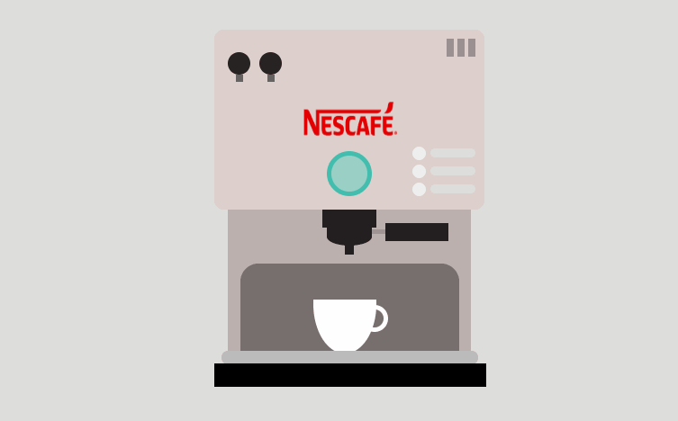

# Coffee-Maker
Minimal Design Nescafe Coffee Maker Machine Using HTML and CSS

Just download the respository and unzip the file.  

Open index.html file and here you go.  

Enjoy your morning nescafe coffee. 

<h4>Follow me in github for more intresting project</h4>

